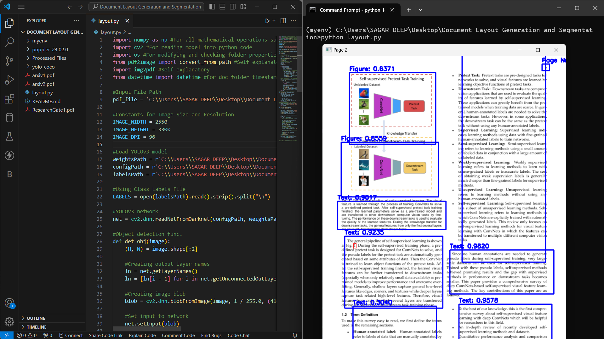
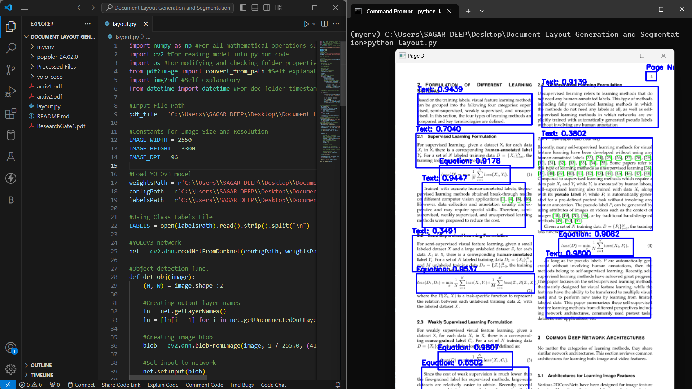

# Document Layout Generation 

## Description

This tool converts any document PDF to its segmented version PDF. 

All middle work can be found in input and output image folder.

## How to Use?

1. Download the ZIP file of the project and open its source folder.

2. Navigate to layout.py and run it directly or by using 

    ```python
    python layout.py

3. If you want to use your own document add it to folder and change the path in layout.py

    ```python
    pdf_file = '...\\(PDF_name).pdf'

4. Observe the results in Processed Files folder.

## Glossary

1. input_img : will show all images in openCV format when extracted from PDF. 
2. output_img : will show all output images after resizing and object detection is done.
3. output_pdf : will display the resultant PDFs of merged output images.

# Screenshots:





# Created by Sagardeep Das